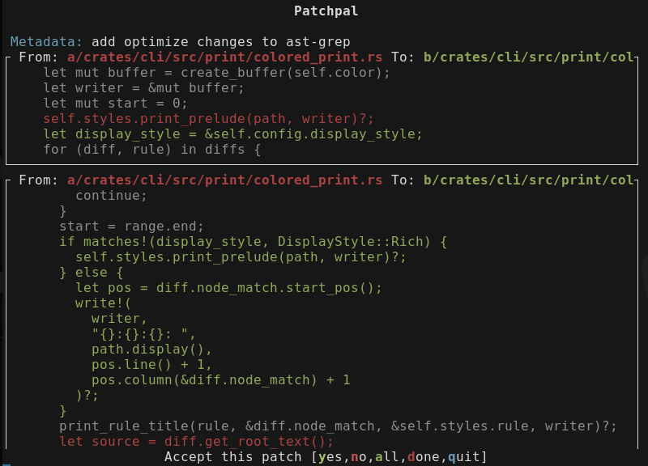
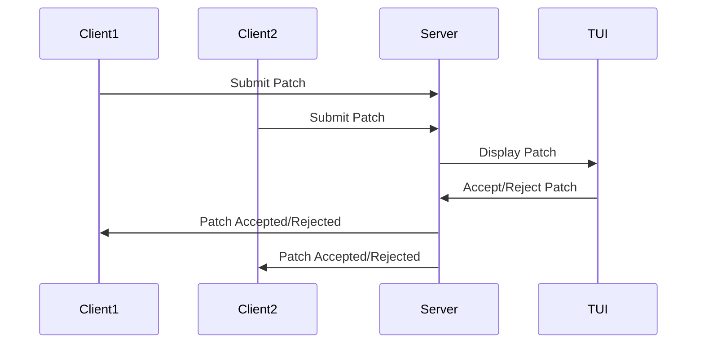

# PatchPal

PatchPal is a tool designed to facilitate the "interactive patch add" workflow
across multiple repositories.

It allows users to submit patches from various repositories to a centralized
server, where they can be reviewed and either accepted or rejected. This is
particularly useful for managing large-scale changes across multiple
repositories.

## Installation

To build and run PatchPal, you need to have Cargo & `protobuf` installed.

1. Run the server:

   ```sh
   cargo run --release -- server
   ```

2. Run the client:
   ```sh
   cargo run --release -- client
   ```

### Client

The client can be used to submit patches from either local repositories
(defaults to current path) or GitHub pull requests (uses the `gh` CLI tool for
authentication).

- **Local Repository**:

  ```sh
  patchpal client --path /path/to/repo
  ```

- **GitHub Pull Request**:
  ```sh
  patchpal client --repo owner/repo --pr-number 123
  ```

### Server

The server listens for incoming patch requests and provides a TUI for reviewing
and managing these patches.

```sh
patchpal server
```

## Workflow

The typical workflow involves multiple clients submitting patches to a
centralized server. The server then displays these patches in a TUI, where they
can be reviewed and either accepted or rejected.



## Contributing

Contributions are welcome! Please open an issue or submit a pull request on
GitHub.
